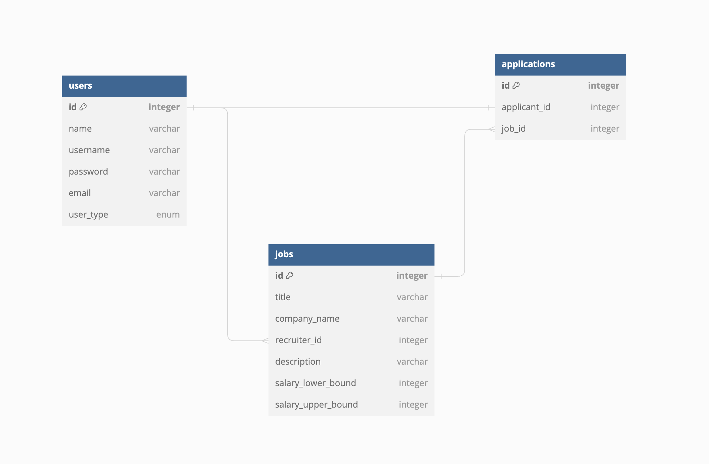

# JobsApp - Project for my Python Course, FMI 2023/2024

## DataBase Scheme

## Run the project
1. Execute `python3 -m venv venv` to create the virtual environment
2. Execute `source venv/bin/activate` (Mac OS) `venv\Scripts\activate.bat` (Windows) to activate the virtual environment
3. Execute `pip install -r requirements.txt` to install the required packages
4. Run `app.py` to start the server
5. Open a browser and go to `http://127.0.0.1:5000`